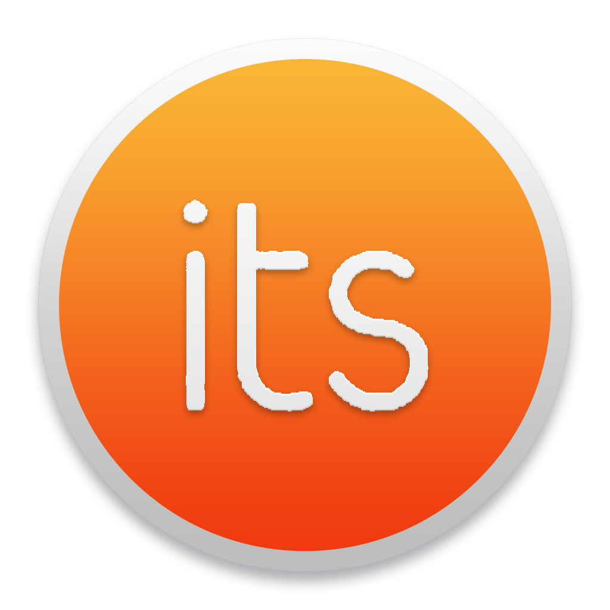

# its 

> Elegant itslearning desktop app

its is an unofficial itslearning app with many useful features, based on code from [Caprine by Sindre Sorhus](https://github.com/sindresorhus/caprine).

## Highlights

- Cross-platform
- Silent auto-updates
- App notification badge

## Install

*macOS 10.9+, Linux, and Windows 7+ are supported (64-bit only).*

Download the latest version below.

### macOS

[**Download**](https://github.com/16patsle/its/releases/latest) the `.dmg` file.

### Linux

[**Download**](https://github.com/16patsle/its/releases/latest) the `.AppImage` or `.deb` file.

*The AppImage needs to be [made executable](http://discourse.appimage.org/t/how-to-make-an-appimage-executable/80) after download.*

### Windows

[**Download**](https://github.com/16patsle/its/releases/latest) the `.exe` file.

*For taskbar notification badges to work on Windows 10, you'll need to [enable it in Taskbar Settings](https://www.tenforums.com/tutorials/48186-taskbar-buttons-hide-show-badges-windows-10-a.html).*


## Features

### Always on Top

You can toggle whether its stays on top of other windows in the `Window`/`View` menu or with <kbd>Cmd/Ctrl</kbd> <kbd>Shift</kbd> <kbd>t</kbd>.

### Background behavior

When closing the window, the app will continue running in the background, in the dock on macOS and the tray on Linux/Windows. Right-click the dock/tray icon and choose `Quit` to completely quit the app. On macOS, click the dock icon to show the window. On Linux, right-click the tray icon and choose `Toggle` to toggle the window. On Windows, click the tray icon to toggle the window.

## Dev

Built with [Electron](https://electronjs.org).

### Run

```
$ npm install && npm start
```

### Build

See the [`electron-builder` docs](https://github.com/electron-userland/electron-builder/wiki/Multi-Platform-Build).

### Publish

Use [`np`](https://github.com/sindresorhus/np) and for example run:

```
$ np minor --no-publish
```

Then edit the automatically created GitHub Releases draft, remove the `.pkg` file, and publish.


## Maintainers

- [Patrick Sletvold](https://github.com/16patsle)


## Disclaimer

its is a third-party app and is not affiliated with itslearning.


## License

MIT
